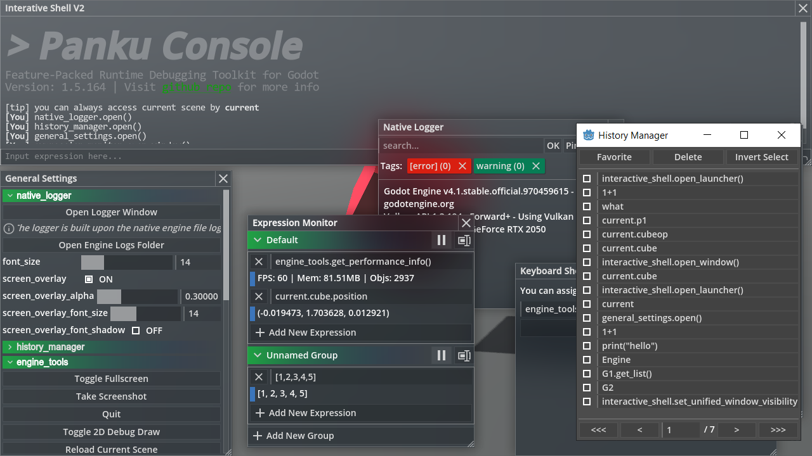

---

**Panku Console is a feature-packed real-time debugging toolkit for Godot Engine.** With Panku Console, you can easily interact with your scripts and objects at runtime, whether to cheat, debug, prototype, or just to have fun.

Panku Console is designed to be modular and extensible, and it is easy to add and maintain features. It is also designed to be as unobtrusive as possible, so you can use it in your project without worrying about the impact on the final product.

# Features

## Multi-window UI

Any windows can be scaled, snapped, collapsed, dragged and even become an independent os window.



## Developer Console

Allows you to execute arbitrary code at runtime like if you were god.


## Native Logger

View native logs (the same as the editor output panel) in an overlay or a separate window.


## Data Controller

Automatically convert all export properties in your script into an inspector window.


## Expression Monitor

Watch the results of expressions in real time.


## And More...

- **History Manager**: view history inputs. 
- **Keyboard Shortcut**: bind expressions to keys for quick cheating.
- **Screen Notifier**: display popup messages on the screen.
- **Texture Viewer**: view textures in real time.

Since Panku Console is modular, you can easily remove or add features to suit your needs. 


For more detailed information, please read the following:

- [Developer Console](./docs/developer_console.md)
- [Native Logger](./docs/native_logger.md)
- [Data Controller](./docs/data_controller.md)
- [Expression Monitor](./docs/expression_monitor.md)
- [History Manager](./docs/history_manager.md)
- [Keyboard Shortcut](./docs/keyboard_shortcut.md)
- [Texture Viewer](./docs/texture_viewer.md)
- [Misc Commands](./docs/misc_commands.md)
- [General Settings](./docs/general_settings.md)

# Installation

1. Download [Latest commit](https://github.com/Ark2000/PankuConsole/archive/refs/heads/master.zip) from Github

2. Copy the `addons` folder to your project root directory

3. Enable this addon within the Godot settings: `Project > Project Settings > Plugins`

Or if you prefer to use git(recommended), you can add this [mirror repo](https://github.com/Ark2000/panku_console) as a submodule in your addons folder which will automatically update the addon when you pull the latest changes.

```bash
# in your project root directory
cd addons
git submodule add https://github.com/Ark2000/panku_console
```

For more information about plugin installation, you can visit the corresponding [Godot documentation](https://docs.godotengine.org/en/stable/tutorials/plugins/editor/installing_plugins.html).

> **Note**: Panku Console currently only supports Godot version 4.x, 3.x support is still in progress.

# Contribute

Do you want to contribute? Learn more in [the contribution section](./CONTRIBUTING.md).

# License

[MIT License](./LICENSE)

Copyright (c) 2022-present, Feo (k2kra) Wu
