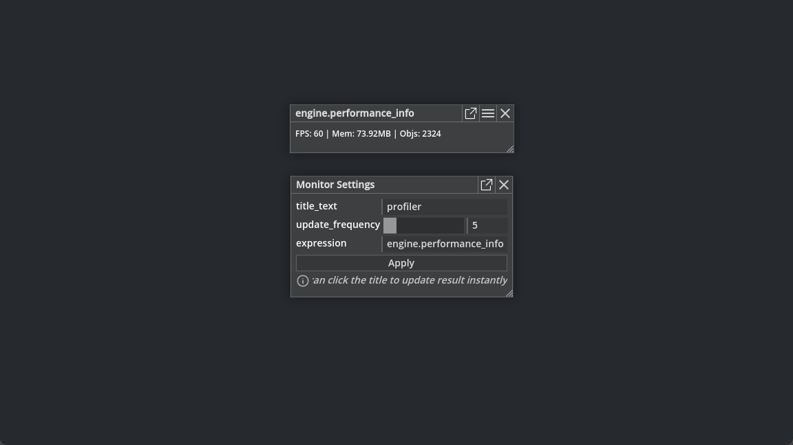

# **Panku Console**
 


全能的[Godot4引擎](https://godotengine.org/)游戏运行时调试工具。

---

语言：[English](README.md) | **简体中文**

# ✨ **插件功能特性简介**

简而言之，这个插件的核心功能就是可以在游戏运行的时候，动态执行一些简单的表达式语句，从而方便游戏的调试。当然远不止这么简单，事实上，这个插件是一系列工具的集合。下面简要介绍一下它的功能特性。

✅ **灵活的窗口系统**。任何功能窗口都可以进行缩放、吸附、拖拽等操作。

✅ **开箱即用的开发者控制台**。不必定义复杂的命令，输入任何表达式，执行并得到结果。

✅ **变量监控**。可以创建悬浮窗口实时查看表达式的结果。

✅ **快捷的全局按键绑定**。将表达式和按键绑定，快速作弊。

✅ **通知界面**。弹出任何值得你关注的消息。

✅ **系统日志叠加层**。将引擎日志输出搬到你的游戏中显示。

✅ **强大的UI面板生成**。直接读取脚本中的导出变量，生成对应的UI调控窗口。

✅ **历史管理**。管理你所有的输入历史，置顶或者合并历史表达式。


# 🧪 **插件的安装步骤**

1. 下载仓库[最新的提交](https://github.com/Ark2000/PankuConsole/archive/refs/heads/master.zip)或者稳定的[Release](https://github.com/Ark2000/PankuConsole/releases)版本。

2. 将`addons`文件夹复制到你的项目根目录中。

3. 在Godot项目插件设置界面中开启`PankuConsole`。

如果想要了解更多关于插件安装的信息，你可以访问对应的[Godot文档](https://docs.godotengine.org/en/stable/tutorials/plugins/editor/installing_plugins.html)。

*注意：本插件仅支持4.x版本，并且我本人不计划提供对3.x的支持。*

> 免责声明⚠：虽然我没有遇见过意外，但鉴于Godot4仍然处于不稳定的Beta阶段，保险起见，建议使用本插件时项目经常备份。

# 📚 **插件快速上手教程**

这个插件的设计目标是尽可能利用Godot自身的特性，提供尽可能少的API，减少对项目的侵入性，让大部分的操作都在运行时完成，不为开发者造成额外的负担，并且使用纯GDScript开发以最大化适用性和维护效率。

插件本身是面向开发者设计的，如果你想在游戏的正式版本中附带该插件，可能需要做出一定的修改，以避免玩家直接访问内部的状态信息，留下安全隐患。

## Godot中表达式的简要说明

所谓的表达式，就是由数学运算符连接的一组常量、变量或者函数调用，比如`console.notify("hello")`，`round(sin(2*PI+1.7*4.2+0.6))`，`null`。另外，表达式是独立于GDScript单独实现的，和你当前使用的编程语言没有任何关系。如果你想了解更多信息，可以查看对应的[Godot文档](https://docs.godotengine.org/en/stable/tutorials/scripting/evaluating_expressions.html?highlight=expression)。

需要特别注意的一点是，像`player.hp = 100`这样的语句并不是表达式，如果你想在表达式中执行赋值操作，可以使用`Object`的`set`方法，比如说`player.set("hp", 100)`,这是一条合法的表达式。

## 开发者控制台简要说明


开发者控制台是这个插件所有功能的入口，属于核心组件。当你启用本插件之后，便可以在几乎任何运行场景中通过按下反引号键`~`（一般在键盘左上角ESC的下面）调出，当然你也可以在项目设置或者输入映射中自定义。

这个插件目前只考虑PC键鼠平台，没有在移动平台上进行过测试，请注意这一点。

在开发者控制台的UI中，你可以：

1. 输入表达式并执行。

    插件提供了一组预定义的对象，帮你快速搞定一些常用的功能，比如切换全屏，设置游戏速度等。在没有补全提示的时候，可以通过上下方向键填充历史输入。有补全提示的时候，按TAB键自动补全。补全功能目前局限为单独的属性或者函数，这一点也许在之后会改进。关于如何导入你自己的对象将在稍后说明。

2. 通过输入框右侧的按钮将输入的表达式转变为监视窗口或者按键。

3. 点击右上角的按键打开设置界面。
   
   设置界面中包含了插件的工具UI入口以及大部分的可配置项，配置文件将会被保存到项目用户文件夹中。你可以在设置窗口中切换极简控制台模式。该模式下，开发者控制台仅保留了输入框和自动补全的功能，更加简洁。

    

## 如何在表达式的执行环境中注册对象

你的脚本默认在表达式的执行环境中是不可以直接访问的，需要手动将其添加到表达式的执行环境。

插件启用时会自动注册一个Autoload单例Console，可以通过这个单例来访问插件的内部。一般来说，只需要用到`Console.register_env`这一个函数。

假设下面是一个Player脚本。

```gdscript
extends Node2D

func _ready():
    #将该对象添加到表达式的执行环境中
    Console.register_env("player", self)

#可选的帮助信息
const _HELP_hello = "sample function"
func hello(name):
    return "hello! %s" % name

#...
```

现在，你可以在开发者控制台中键入`player.hello("Jason")`，直接调用上述脚本中定义的函数。

脚本中，任何**不以下划线开头**的方法或属性都会被添加到开发者控制台的自动补全系统中（当然它们仍然可以被访问）。可选的，可以为方法或者属性添加说明信息，具体方法为，定义字符串常量，命名为`_HELP_` + 对应的方法或属性名。

另外，可以在插件目录下的`default_repl_envs`文件夹中查看插件预定义的注册对象。

## 如何使用表达式监视器



利用表达式监视器，可以实时观察某个表达式的字符串结果（甚至是材质）。

可以自定义表达式监视器的刷新频率、标题等。

如果点击标题栏，将会立刻刷新计算表达式的结果。利用这一点，可以将某个表达式监视器的刷新频率设置为0，这样就变成了一个浮动的按钮。

在项目启动运行时，插件会自动从配置文件中加载上一次运行中所有表达式监视器的状态信息，避免重复创建。

有两种在运行时创建表达式监视器的方法：

1. 直接在开发者控制台中输入表达式，然后点击输入框右侧的按钮进行创建。

2. 通过预定义的对象创建，具体为`console.add_exp_monitor(...)`。

## 如何使用导出变量UI窗口生成器


利用导出变量UI窗口生成器，可以为你的某个注册对象直接生成对应的导出变量窗口，方便在运行中观察和调整。

插件提供了一个简单的导出变量UI窗口生成器的示例文件，位于`demo`文件夹下，可以通过它直观了解该功能的具体特点。

可以在UI界面中实时修改变量的值，UI界面同样会实时更新变量的值。

运行时使用该功能的方法：`console.add_exporter(...)`。

另外，值得注意的一点是，开发者控制台的设置界面也是完全利用该功能生成的。

目前支持的导出变量类型如下：

```gdscript

#以下划线开头的导出变量将会被忽略。
@export var _ignored := 0

#0. 分组按钮
@export_group("Group 1")

#1. 滚动字幕单行注释。名称需要以`export_comment_`开头。
@export var export_comment_1 = "This is a comment"

#2. 按钮。名称的格式为`export_button_xxx`，其中`xxx`为同文件中的无参函数名，点击按钮会调用该函数。
@export var export_button_xxx = "Click Me"

#3. 布尔变量。
@export var bool_val:bool = false

#4. 颜色变量。
@export var color_val:Color = Color.WHITE

#5. 字符串变量。
@export var string_val:String = ""

#6. 普通整形变量。
@export var int_val:int = 0

#7. 普通浮点数变量。
@export var float_val:float = 0

#8. 带范围的数字(整数或浮点数)变量。
@export_range(0.0, 1.0, 0.01) var ranged_number := 0.0

#9. 二维向量
@export var vec2_val:Vector2 = Vector2.ZERO

#10. 枚举整数值
@export_enum("option 1", "option 2", "option 3") var enum_val := 0

#11. 不支持的变量将会以只读字符串的形式显示。
@export var node_val:Node

#12. 你可以通过setget函数控制访问行为。
@export var dummy_val:int:
    set(val): pass
    get: return 0

#按钮回调函数
func xxx():
    print("xxx is called")

```

## 如何使用表达式按键绑定功能


利用该功能，可以将表达式的执行绑定到某个按键，比如快速截屏、切换全屏等。目前暂不支持组合键。

该功能入口：

1. 在开发者控制台设置界面中点击`Open Expression Key Mapper`按钮打开。
2. 开发者控制台中执行`console.open_keybindings`打开。

按键绑定信息将会被保存到配置文件中。

## 如何使用历史表达式管理器


利用该功能，可以查看并管理开发者控制台的输入历史，将常用的表达式置顶，合并多个表达式的字符串结果等。

该功能入口：

1. 在开发者控制台设置界面中点击`Open Expression History`按钮打开。
2. 开发者控制台中执行`console.open_history`打开。

历史输入信息将会被保存到配置文件中。

# **贡献**

感谢这些[为本项目做出贡献的人](https://github.com/Ark2000/PankuConsole/graphs/contributors)，期待更多的人参与本项目，为Godot的生态发展添砖建瓦，参与的方式包括但不限于：

1. 如果发现缺陷或者有新的想法，可以提出[Issue](https://github.com/Ark2000/PankuConsole/issues)

2. 如果有疑问，可以在[讨论区](https://github.com/Ark2000/PankuConsole/discussions)讨论

3. 你也可以为本项目直接[贡献代码](https://github.com/Ark2000/PankuConsole/pulls)，提交信息的规范请参考[最近的提交](https://github.com/Ark2000/PankuConsole/commits/master)或者[这里](https://www.conventionalcommits.org/en/v1.0.0/#summary)

# **开源协议**

[MIT License](LICENSE)

Copyright (c) 2022-present, Feo (k2kra) Wu